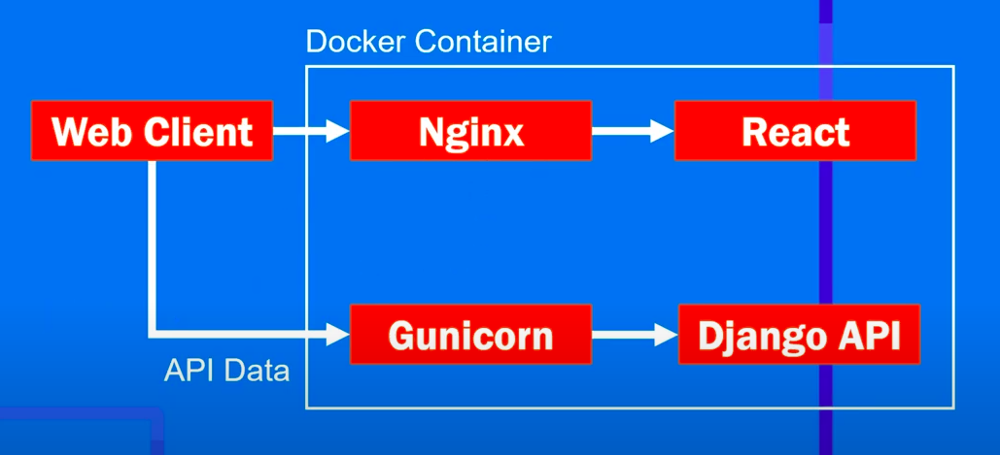

# Todo-App-TDD

Test-driven development (TDD) is a software development process relying on software requirements being converted to test cases before software is fully developed, and tracking all software development by repeatedly testing the software against all test cases. This is as opposed to software being developed first and test cases created later. [Wikipedia](https://en.wikipedia.org/wiki/Test-driven_development).


### General Structure of the Project

| Technologies | Description |
| --- | --- |
| Django |  Backend Design |
| React | Frontend Desing |
| Nginx | Server  |
| Docker | Containerization |

### Libraries Used for Testing

| Technologies | Libraries |
| --- | --- |
| Django |  I used the TestCase library, which is django's own library. |
| React | Jest, Pact, Taiko, Enzyme |


### Examples From Tests

1. #### Django - Backend
  The test is written first. so we get error.
  ```
  from django.test import TestCase
  from .models import Todo

  class TestTodoModel(TestCase):
      def test_creat_todo(self):
          todo = Todo(content="Yeni todo")
          todo.save()
          self.assertEqual(todo.content,"Yeni todo")
  ```
  then we write the code that will pass the test.
  
  ```
  from django.db import models

  class Todo(models.Model):

      content = models.TextField(default='Todo',null=True, blank=True)
      def __str__(self):
          return "Todo"
  ```
  
  we are testing the creation of a new todo
  ```
      def test_create(self):
        create = self.client.post("/create", {"content": "Yeni todo"})
        todo = get_object_or_404(Todo, pk=1)
        self.assertEqual(todo.content, "Yeni todo")
  ```
  
2. #### React - Frontend

  - Testing sending textarea value
  ```
  test("submit button onClick event test", () => {
    wrapper
      .find("TextArea")
      .simulate("change", { target: { value: "Yeni todo" } });

    expect(wrapper.state("currentTodo")).toEqual("Yeni todo");
  });
  ```
  
  - Transferring the sent text to the list
  ```
   test("todo table list test", () => {
    wrapper
      .find("TextArea")
      .simulate("change", { target: { value: "Yeni todo" } });

    const table = wrapper.find('Table');
    //Sayfamızda bir tablo olmasını bekliyoruz
    expect(table).toHaveLength(1);

    const tbody = table.find('Body');

    const row = tbody.find('Row');

    row.forEach((tr) => {
      const cells = tr.find('Cell');
      expect(cells.at(0).text()).toEqual('Yeni todo');
    });
  ```
  - Service tests with Pact
  
  You can follow this blog for pact installation and sample testing.[Here](https://reflectoring.io/pact-react-consumer/)
  We have prepared the interface of our application. Now we have completed the interface, but we do not have a backend  service. 
  We need to test our application.  We will use Pact for this. With Pact, it helps us to test our application as if data is coming from the backend service.
  
  -Testing the service that brings all the todos from the database :
 
         Get all todo service:
          ```
             getTodos() {
                return axios.request({
                    method: 'GET',
                    url: "/",
                    baseURL: `${this.baseUrl}:${this.port}`,
                    headers: {
                        'Accept': 'application/json; charset=utf-8'
                    }
                }, adapter).then(function(response)  {
                   return JSON.stringify((response.data))
                });
            };
          ```
          First( beforeEach ) we make a request to the service and then ( it ) we define what the response should be. If the answer is as expected, our test 
          passes successfully.
          ```
          describe("getTodos()", () => {
                beforeEach((done) => {
                  global.provider
                    .addInteraction({
                      state: "a todo exists",
                      uponReceiving: "a GET request for a todo",
                      withRequest: {
                        method: "GET",
                        path: "/",
                        headers: {
                          Accept: contentTypeJsonMatcher,
                        },
                      },
                      willRespondWith: {
                        status: 200,
                        headers: {
                          "Content-Type": contentTypeJsonMatcher,
                        },
                        body: Pact.Matchers.somethingLike(
                          new Todo("Todo 111", 1),
                          new Todo("Todo 222", 2)
                        ),
                      },
                    })
                    .then(() => done());
                });

                it("sends a request according to contract", (done) => {

                  todoService
                    .getTodos()
                    .then((todos) => {
                      expect(todos).toEqual(new Todo("Todo 111", 1),
                      new Todo("Todo 222", 2));
                    })
                    .then(() => {
                      global.provider.verify().then(
                        () => done(),
                        (error) => {
                          done.fail(error);
                        }
                      );
                    });
                });
              });
          ```
          You can review the codes for other tests.
          

- Testing the interface with Taiko
  
  Taiko opens the project in the browser window and tests the interface components.[Source](https://docs.taiko.dev/record_and_run_tests/)
  
  ```
          const { openBrowser, goto, textBox, into, write, $, click, closeBrowser } = require('taiko');
        (async () => {
            try {
          await openBrowser();
                await goto("http://localhost:3000/");
                await write("Yeni todo.....",into(textBox({placeholder:"Keep Note......." })));
                await click($(`//*[text()='Create']`));
            } catch (error) {
                console.error(error);
            } finally {
                await closeBrowser();
            }
        })();
  ```
  In the above code snippet, when we open the project, write a new todo in the textarea field and click the create button, it adds it to our list.
  
  
3. #### Build a container with Docker

Docker is a set of platform as a service (PaaS) products that use OS-level virtualization to deliver software in packages called containers.
Containers are isolated from one another and bundle their own software, libraries and configuration files; they can communicate with each other through well-
defined channels. Because all of the containers share the services of a single operating system kernel, they use fewer resources than virtual machines.[Wiki](https://en.wikipedia.org/wiki/Docker_(software))



Nginx provides the communication of react and django nu. Requests from the client are directed to the django side with nginx and the incoming responses
are transferred to the react side.

The architectural structure of our Docker containers is built as follows.

        ```
        version: '3'

        services:
          backend:
            build: 
              context: ./backend
            command: gunicorn todo_app.wsgi --bind 0.0.0.0:8000
            ports:
              - "8000:8000"
          frontend:
            build: 
              context: ./frontend/todoapi
            volumes:
              - react_build:/react/build
          nginx:
            image: nginx:latest
            ports:
              - 80:8080
            volumes:
              - ./nginx/nginx-setup.conf:/etc/nginx/conf.d/default.conf:ro
              - react_build:/var/wwww/react
            depends_on:
              - backend
              - frontend
        volumes:
          react_build:
      ```
  
